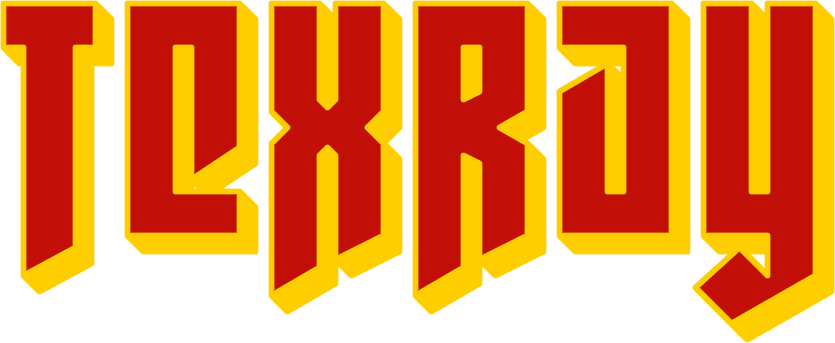

<p align="center">
  
</p>

# 3D Raycasting with pygames

A simple yet powerful raycasting renderer built in Python using Pygame.  
Inspired by classic 3D games like Wolfenstein 3D, this project demonstrates the basics of 3D graphics using raycasting and texture mapping.

---

## Features

- Raycasting with DDA algorithm for precise wall collision detection  
- Textured walls, floor, and sky  
- Fish-eye correction for realistic perspective  
- Dynamic lighting based on distance  
- Floor casting for realistic ground rendering  
- Minimap displaying player position  
- Player movement with rotation and collision detection

---

## Installation

1. Install Python 3.8+ from [https://www.python.org/downloads/](https://www.python.org/downloads/)  
2. Install Pygame:
   ```bash
   pip install pygame
   ```
3. Clone this repository:
   ```bash
   git clone https://github.com/nathanschmid08/TexRay.git
   cd your-repo
   ```

4. Make sure the texture files are inside the textures/ folder (wall1.png, floor.png, sky.png)

---

## Usage

```bash
python TexRay.py
```
- W/S to move forward/backward
- A/D to strafe left/right (to be added)
- Left/Right arrow keys to rotate
- ESC to quit

---

## Code Overview

TexRay.py – Main logic including raycasting, input handling, and rendering
textures/ – Texture images for walls, floor, and sky
md/ – Assets and images used in this README

---

## License

This project is licensed under the MIT License.

---

## Support

Thanks for checking out the project!
Feel free to open issues, provide feedback, or submit pull requests! 🚀
